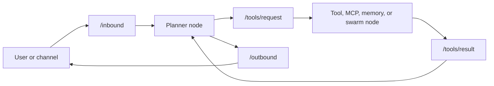

# Graph engineering with AgentBus

Graph engineering is the practice of treating an agent system's topology as a
first-class artifact: explicit contracts, visible edges, replayable execution,
and components that can be changed independently. AgentBus is built for this
discipline.

It is not a visual wrapper around a hidden agent loop. Nodes declare the topics
they publish and subscribe to; topics define the payload schema and retention;
the bus renders the resulting graph and records the messages that actually
traveled through it.

## The graph is the architecture



Each edge is a named, typed topic rather than an incidental function call. That
gives a team a stable place to ask practical questions:

- What can publish this message, and who consumes it?
- What schema crosses this boundary?
- Which node is slow or overloaded?
- What happened for this user request?
- Can we replace an integration without changing the planner?

## A workflow that stays understandable

1. **Model boundaries as topics.** Start with domain messages such as
   `/orders/validated` or `/research/findings`, not with one giant agent
   function.
2. **Make nodes small and replaceable.** A node should own one behavior:
   planning, retrieval, execution, review, or delivery. It does not import its
   neighbors.
3. **Give important topics retention.** Retention makes a graph inspectable
   after the fact; a durable `SqliteLog` adds replay across restarts.
4. **Inspect before optimizing.** Use the graph, topic history, correlation
   IDs, and lifecycle events to find the actual bottleneck or failed edge.
5. **Evolve contracts deliberately.** Pydantic schemas turn a changed payload
   into a clear boundary decision rather than a downstream mystery.

The result is a graph you can reason about like a production system—not a
sequence of opaque model calls.

## See the system you built

Every running bus exports its topology. The same graph is available to the
CLI, the built-in dashboard, and your own tooling:

```bash
agentbus graph --format mermaid
agentbus topic echo /tools/request
agentbus node info planner
```

For a browser view, run `agentbus ui`. The dashboard shows nodes and topics,
live topic history, counters, and durable replay. It can also generate ordinary
Python node and schema files; the generated workflow remains yours to inspect,
version, and run without the UI.

## The built-in chatbot is a reference graph

`agentbus chat` is a complete, local-first chatbot implementation, not a toy
example. It wires a planner, tool executor, status stream, and response capture
node around the same `/inbound`, `/tools/request`, `/tools/result`, and
`/outbound` topics you use in an application. Optional MCP, memory, channels,
and swarm workers extend that graph without special orchestration paths.

This is intentional: start with a useful conversational agent, inspect its
graph while it works, and then replace or add nodes as your product requires.

## Reliability at graph boundaries

AgentBus applies reliability mechanisms where edges fail: schema validation,
bounded queues with explicit backpressure behavior, request/reply timeouts,
circuit breakers, correlation-aware structured logging, graceful draining, and
atomic session writes. The chat runner adds sandboxing and permission policy to
tool execution.

Those controls are visible in system topics and the trace commands. Reliability
is therefore part of the graph's operating model, not a separate logging
exercise.
